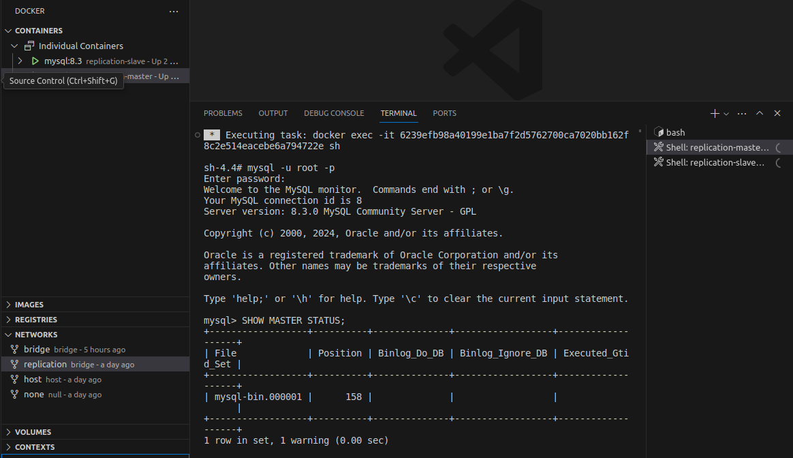
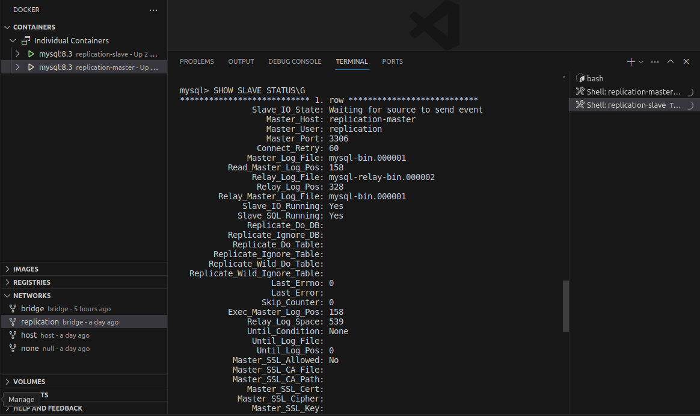
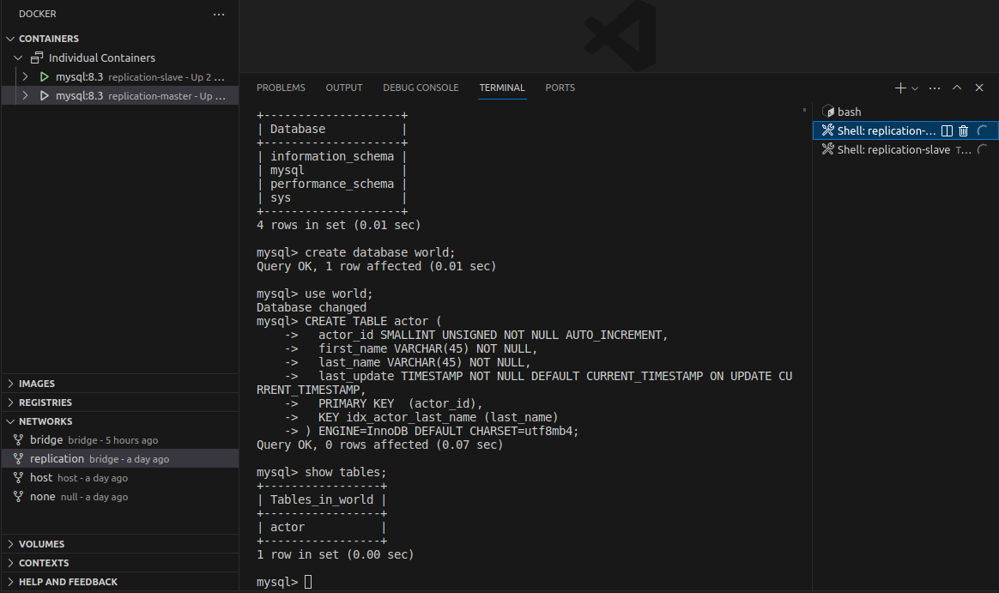
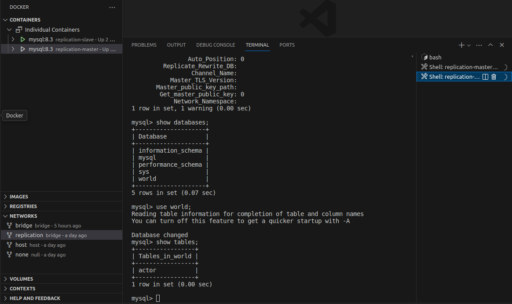
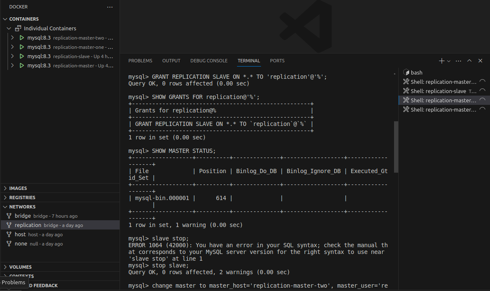
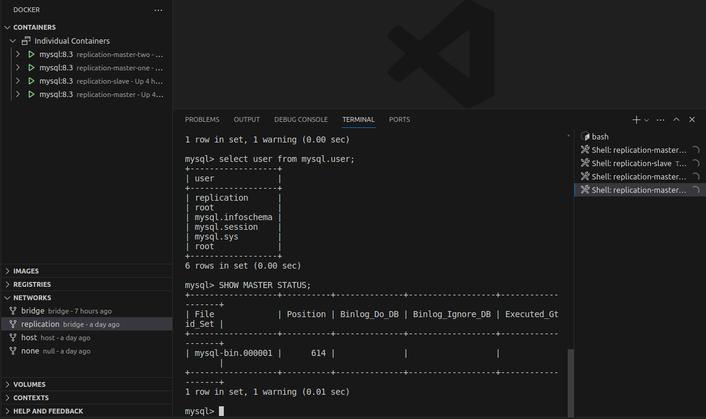
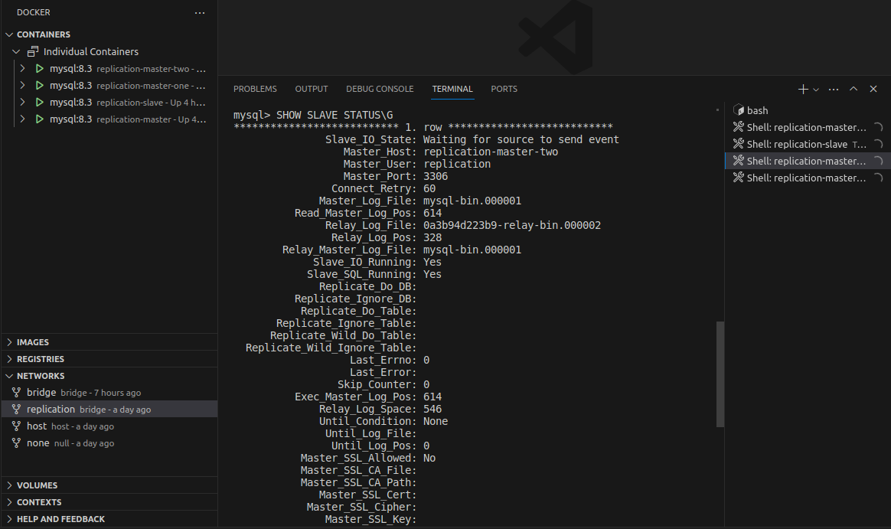
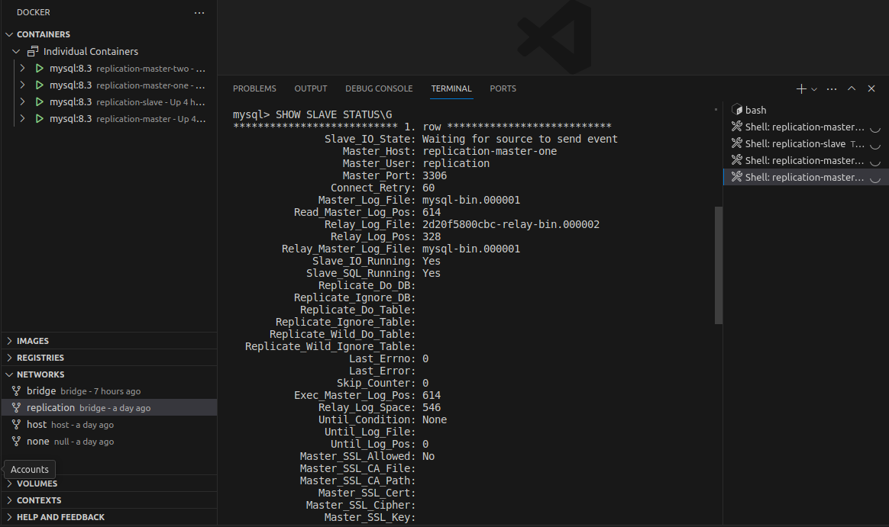
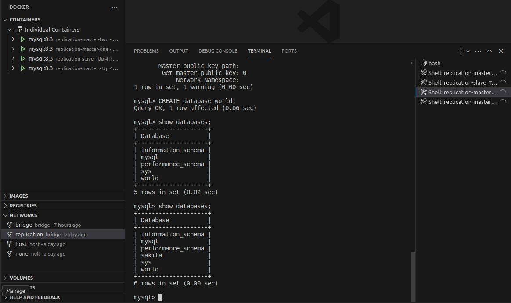
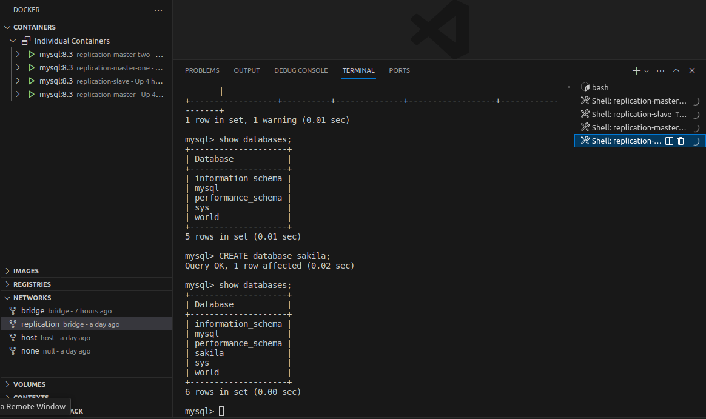

## Домашнее задание к занятию "Репликация и масштабирование. Часть 1" - Карих Елена
---
### Задание 1

На лекции рассматривались режимы репликации master-slave, master-master, опишите их различия.
Ответить в свободной форме.

### Решение 1

Репликация master-slave: Такая конфигурация используется для повышения отказоустойчивости, для распределения нагрузки
и использована для резервного копирования. Все изменения в БД заносятся на Master. Slave - вспомогательный сервер БД, на который реплицируются все данные с Mastera БД. Slave используется только для чтения данных.

Репликация master-master: В отличии от репликации master-slave репликация master-master происходить в обе стороны, т.е. каждый сервер БД является и Master-ом и Slave-ом одновременно. Избыточность конфигурации повышает надежность, скорость работы и доступность данных.
Вот только при выходе из строя одного из Master возможна потеря данных(( а пока все работает - все хорошо.

---
### Задание 2

Выполните конфигурацию master-slave репликации, примером можно пользоваться из лекции.
Приложите скриншоты конфигурации, выполнения работы: состояния и режимы работы серверов.

### Решение 2

Подняла 2 контейнера для Master и Slave, зашла на Master, создала пользователя с правами:

```
mysql> CREATE USER 'replication'@'%';
Query OK, 0 rows affected (0.11 sec)

mysql> GRANT REPLICATION SLAVE ON *.* TO 'replication'@'%';
Query OK, 0 rows affected (0.01 sec)

mysql> SHOW GRANTS FOR replication@'%';
+-----------------------------------------------------+
| Grants for replication@%                            |
+-----------------------------------------------------+
| GRANT REPLICATION SLAVE ON *.* TO `replication`@`%` |
+-----------------------------------------------------+
1 row in set (0.00 sec)
```

Внесла измения в конфигурационные файлы: [master_my.cnf](master_my.cnf) 

Перезагрузила оба, проверила статус, прописала настройки на Slave, проверила




Создала базу "World" и таблицу "actor" проверила репликацию этих данных на Slave:




---
### Задание 3

Выполните конфигурацию master-master репликации. Произведите проверку.
Приложите скриншоты конфигурации, выполнения работы: состояния и режимы работы серверов.

### Решение 3

Подняла два новых контейнера master-one и master-two, на каждом создала пользователя, внесла изменения в конфигурационный файл, перезагрузила, остановила slave, прописала для каждого своего mastera, включила slave, проверила статус:




 

Не знаю как корректнее проверить... первое что пришло в голову - это создать базу "world" на одном и проверить на втором ее наличие; 
и создала на втором базу "sakila" и проверила ее репликацию на первом...




---
